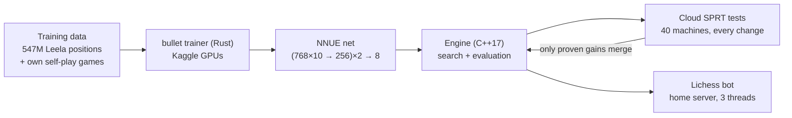

# KavinEngine: a chess engine built from scratch that beats Ethereal and Halogen

A UCI chess engine in C++17, written from an empty file in October 2026: bitboard move generation, an alpha-beta search and
a neural-network evaluation (NNUE) trained on GPUs in the cloud. It plays at **~3449 on the CCRL Blitz scale**, measured
against eight independent engines, and it runs as a **live bot on Lichess**. The same source also compiles for a ~$10
ESP32-S3 microcontroller.

**▶ Watch it replay its latest game (wizard-chess style): [kavinjain.in/chess](https://kavinjain.in/chess)**, or challenge it directly on Lichess:
[lichess.org/@/KavinEngine](https://lichess.org/@/KavinEngine) (free account, any time control from 1+0 to 30+20).

| | |
|---|---|
| **Strength** | **3449 ± 11** on the CCRL Blitz scale: 1,536 games against 8 engines from 7 families ([below](#how-strong-is-it)) |
| **Beats** | Ethereal 12.75 (55.2 %), Halogen 11 (56.8 %), Stash 35/37 |
| **Lichess** | blitz 2463 after 128 games (rapid still provisional), on a 2-core home server |
| **Tested** | 39 logged tests, **151,992 games**, mostly on up to 40 parallel cloud machines; failures are logged too ([docs/sprt-log.md](docs/sprt-log.md)) |
| **Gained in one day** | 3288 → 3377 → **3463** against the same Stash anchors (2026-10-08): speed-ups, then a net trained on Leela Chess Zero data |
| **Built by** | Kavin Jain, 18, Udaipur, India ([about](#about-and-honesty)) |

> **Status:** strong and stable on PC and Lichess. The rating is an estimate on CCRL's scale from our own games
> (60+0.6, GitHub's Linux machines, one thread), not an official CCRL listing. The ESP32-S3 build compiles with a smaller
> net; on-device play is the next hardware milestone.

---

## How it thinks

- **Search** (`src/search.cpp`): principal-variation alpha-beta with iterative deepening and aspiration windows, a
  transposition table, null-move pruning, late-move reductions, reverse futility and futility pruning, static-exchange
  (SEE) pruning, internal iterative reductions, correction history, check extensions and a quiescence search.
- **Evaluation** (`src/nnue.cpp`): an efficiently updatable neural network. 768 inputs × 10 mirrored king buckets feed a
  256-neuron layer per side, with SCReLU activation and 8 output buckets by material. Integer-quantised, updated
  incrementally move by move, with a refresh cache ("Finny tables") when a king changes bucket.
- **Time management:** spends more time when the best move keeps changing and less when it's stable and has taken most of
  the search; a configurable clock reserve keeps an online bot safe from network drops.
- **Endgames:** a dedicated mop-up evaluation drives a lone king to the edge. It mates K+Q vs K in about the tablebase
  minimum, where the net alone wandered for 37 moves.

## How strong is it

Rated by maximum likelihood against engines whose CCRL Blitz ratings are known, each built from its official release tag
and checked by name before playing ([tools/gauntlet.py](tools/gauntlet.py), games in
[results/gauntlet/honest-2026-10-08](results/gauntlet/honest-2026-10-08/)):

| Opponent (family) | Their CCRL Blitz | Our score | Our performance |
|---|---|---|---|
| Stash 35 | 3345 | 62.2 % | 3432 |
| Stash 37 | 3417 | 53.9 % | 3444 |
| Ethereal 12.75 | 3424 | **55.2 %** | 3460 |
| Halogen 11 | 3425 | **56.8 %** | 3472 |
| Koivisto 7.0 | 3529 | 41.7 % | 3471 |
| Berserk 8.5 | 3575 | 28.9 % | 3419 |
| Altair 7.0.0 | 3579 | 33.9 % | 3463 |
| Alexandria 6.0.0 | 3630 | 23.4 % | 3424 |

Every per-opponent performance lands between 3419 and 3472, so no single family drives the number.
**Fit: 3449 ± 11** (95 %).

## How every change is tested

Nothing merges on a hunch. Each change plays thousands of games against the current version on GitHub Actions
(fastchess, 8+0.08, balanced UHO openings) under a sequential probability ratio test (SPRT) with pentanomial statistics:
the test stops as soon as the evidence is strong enough either way.

**What made it stronger** (measured, merged):

| Change | Elo |
|---|---|
| Neural-network evaluation (vs hand-written PeSTO tables) | +557 ± 141 |
| Reverse futility pruning | +110.7 ± 20.0 |
| Aspiration windows | +71.2 ± 16.1 |
| Net trained from scratch on 547M Leela Chess Zero positions | +65.0 ± 10.9 |
| Self-play fine-tune of the net | +54.5 ± 12.0 |
| Singular extensions with multi-cut | +42.6 ± 9.7 |
| Futility pruning | +37.2 ± 11.3 |
| SEE in quiescence search and capture ordering | +35.0 ± 7.1 |
| King-bucketed network inputs | +24.5 ± 8.1 |
| Internal iterative reductions | +21.0 ± 6.6 |
| Correction history | +17.6 ± 7.3 |
| Mop-up evaluation for won endgames | +12.5 ± 6.4 |
| Node-share time management | +7.2 ± 4.3 |
| SEE pruning in the main search | +6.4 ± 4.2 |
| **Multi-threaded search, 2 threads vs 1** (Lichess bot) | **+69.2 ± 8.7** |

Plus bit-identical speed-ups (same moves, faster): clang instead of gcc **+8.0 %**, refresh cache **+4.2 %**, lazy SEE
**+1.6 %** nodes per second. On this engine 1 % speed ≈ 1 Elo.

**What did not work, kept for the record:** continuation history, capture history, late-move pruning, an "improving"
flag, eval-based null-move reductions and two kinds of history-driven reductions all lost Elo here. Training on the
"hardest" 25 % of positions selected label noise (−14 vs a random 25 %), and the first teacher-distillation run overfit
(fine-tunes of ~26 epochs). All in [docs/sprt-log.md](docs/sprt-log.md), with games in [results/](results/).

## Research: how big should the network be?

An original study of how NNUE evaluation accuracy and playing strength scale with network width and data, and where the
best width lies for a given device ([docs/research/2026-10-08-nnue-scaling-study.md](docs/research/2026-10-08-nnue-scaling-study.md)):

- Held-out loss follows a power law in width: **loss(N) = 0.00335 + 0.0089 · N^−0.278**.
- Wider is not stronger by itself: a 512-wide net had 6 % lower loss yet lost 16 Elo to 256, because it searched 19 %
  fewer positions per second. Modelled as strength = quality(N) + 72 · log2(speed), the optimum on a desktop is
  **N ≈ 400** (245–663 within 5 Elo). On a microcontroller the optimum is predicted to be smaller; that gets measured
  on the board.

## The Lichess bot

[@KavinEngine](https://lichess.org/@/KavinEngine) runs on a home server (Intel i3, 2 cores) through
[lichess-bot](https://github.com/lichess-bot-devs/lichess-bot):

- 3 search threads, one game at a time: strength over game count.
- Opening book (Cerebellum Light) and Syzygy endgame tablebases, read by lichess-bot, not by the engine. The CCRL-scale
  rating above is measured without either.
- A 30-second clock reserve, so a home Wi-Fi drop can't lose a game on time.
- A Telegram bot reports its games every morning and can run a Stockfish post-mortem of any game on request
  ([tools/bot_ops.py](tools/bot_ops.py)).

## Build and run

| Target | Command |
|---|---|
| Engine (UCI, any GUI or lichess-bot) | `make` → `./engine` |
| Tests | `make test` |
| Bench signature | `./engine bench` → `3901015` nodes |
| ESP32-S3 | `cd esp32 && pio run -e s3 -t upload`, then UCI over USB: `python tools/uci_bridge.py /dev/cu.usbmodemXXXX` |

## Layout

| Path | What |
|---|---|
| `src/` | the portable engine: board, move generation, search, NNUE, UCI |
| `pc/`, `esp32/` | the two targets; only `src/platform.h` differs |
| `tests/` | assert-based unit tests (perft, draws, search, NNUE, TT, UCI) |
| `train/`, `tools/kaggle/` | network training (bullet, Rust) and the Kaggle GPU runner |
| `tools/` | data generation, relabelling, cloud SPRT and gauntlet drivers, game analysis |
| `.github/workflows/` | the cloud test, data and analysis pipelines |
| `docs/` | test log, measurements, method, research |

## About and honesty

Built by **Kavin Jain**, 18, from Udaipur, India, as an independent project. He set the goals, made the design and
research decisions, and ran the project; the code was written with AI assistance (Claude). Every claim above links to the
games or logs that back it.

Credits, data and licences:

- **Default net `nets/leela-256.bin`:** trained from scratch on 547M positions of Leela Chess Zero training data, as
  converted in [linrock/bullet-training-data](https://huggingface.co/datasets/linrock/bullet-training-data). Lc0 training
  data is under the **Open Database License (ODbL)**, and this net is a Produced Work from it. Scores were rescaled to the
  engine's centipawns (`EVAL_SCALE` = 1106, calibrated against the previous net).
- **Earlier nets:** the Lichess evaluation database (CC0, Stockfish evaluations) and the engine's own self-play games.
- **First evaluation:** PeSTO tables by Ronald Friederich, credited in `src/pesto_tables.h`.
- **Tools:** [bullet](https://github.com/jw1912/bullet) (training), [fastchess](https://github.com/Disservin/fastchess)
  (testing), UHO and 8moves opening books from the Stockfish project.
- **Lichess bot only:** the Cerebellum Light 3Merge book by Thomas Zipproth
  ([CC BY-NC-SA 4.0](https://creativecommons.org/licenses/by-nc-sa/4.0/)) and Syzygy tablebases. Neither is part of
  this repository.
- No Stockfish or Leela code or network weights are used.

Licence: **GPL-3.0** (see `LICENSE`).
